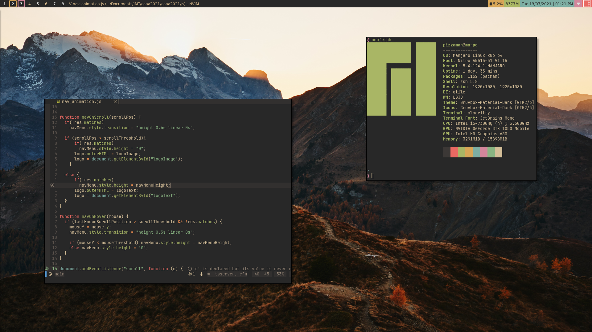

# Dotfiles

Configurations for my archlinux system, Gruvbox everywhere

- Alacritty
- Nvim (can be found here : https://github.com/AlexisAoun/nvim-basic-ide)
- Dwm (can be found here : https://github.com/AlexisAoun/dwm)
- slstatus (can be found here : https://github.com/AlexisAoun/slstatus)
- i3 (old)
- Qtile (old)
- Polybar (old)

Old Screenshot with Qtile

          
